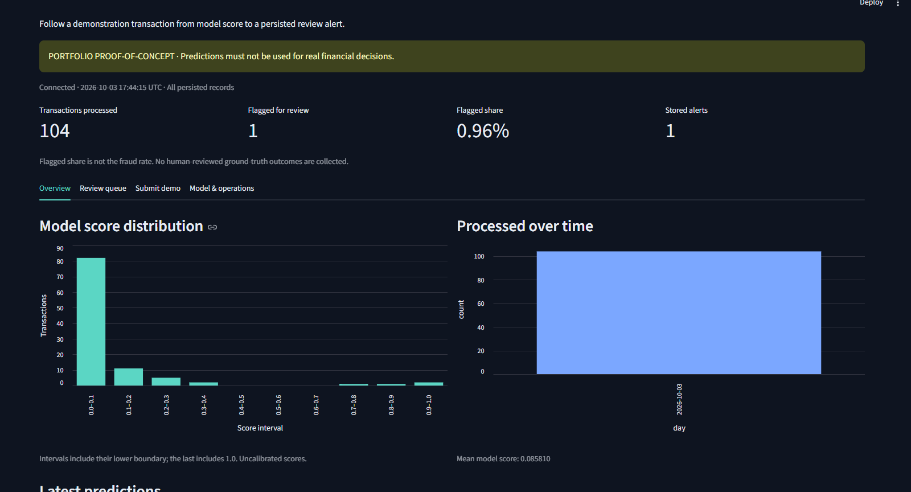
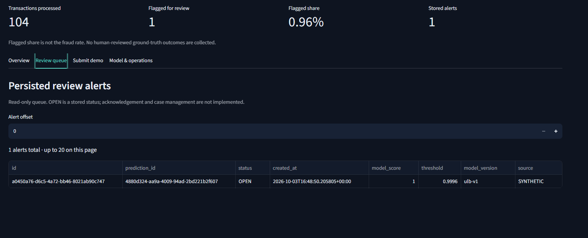

# Fraud Detection & Analytics Delivery Platform

[](https://github.com/Sreejith4554/fraud-detection-analytics-platform/actions/workflows/ci.yml)
[](https://github.com/Sreejith4554/fraud-detection-analytics-platform/actions/workflows/codeql.yml)

A working end-to-end portfolio proof-of-concept demonstrating how a machine-learning fraud model can be delivered as a tested, containerized analytics platform with API inference, PostgreSQL persistence, transactional alert creation, operational analytics, automated quality gates, and reproducible release evidence.

> **Portfolio proof-of-concept — not a production banking system.**
>
> Runtime demonstrations use validation-data replays and explicitly labelled synthetic inputs. Model outputs must not be used for real financial decisions.

---

## What this project demonstrates

This project goes beyond training a machine-learning model in a notebook. It treats the model as one component in a broader software-delivery system.

The implemented platform demonstrates:

- reproducible dataset validation and partitioning
- model training, selection, and held-out evaluation
- frozen model artifact with integrity verification
- FastAPI inference and operational endpoints
- validated API contracts
- PostgreSQL persistence
- explicit database schema migration
- transactional prediction and alert creation
- Streamlit analytics and review views
- Docker Compose deployment
- health and readiness checks
- database restart and persistence verification
- automated integration testing
- automated container/runtime verification
- dependency vulnerability auditing
- CodeQL static security analysis
- Dependabot dependency monitoring
- evidence-backed technical and release documentation

The implementation is an AI-assisted portfolio engineering project inspired by research from Sreejith Sivakumar's MBA dissertation. It was built separately from the dissertation and is not presented as employment experience or as a production banking implementation.

---

## System architecture

```text
Accepted transaction data
          |
          v
Data validation / feature preparation
          |
          v
   Frozen ML model
          |
          v
  FastAPI inference service
          |
          +----------------------+
          |                      |
          v                      v
     PostgreSQL             Model metadata
     transactions           health/readiness
     predictions            operational metrics
     alerts
          |
          v
 Streamlit analytics dashboard
```

The containerized runtime is:

```text
                    ┌─────────────────┐
                    │    Streamlit    │
                    │    Dashboard    │
                    │      :8501      │
                    └────────┬────────┘
                             │
                             ▼
                    ┌─────────────────┐
                    │     FastAPI     │
                    │       API       │
                    │      :8000      │
                    └────────┬────────┘
                             │
                             ▼
                    ┌─────────────────┐
                    │   PostgreSQL    │
                    │  internal only  │
                    └─────────────────┘
                             ▲
                             │
                    Database migration

FastAPI ────────────────> Verified frozen model
```

The dashboard communicates with the API rather than directly accessing PostgreSQL.

See [architecture documentation](docs/architecture/design.md) for the detailed design.

---

## Working application

The platform runs as an integrated application rather than as a static case study.

Transactions can pass through the FastAPI inference service, receive a model score and review decision, be persisted in PostgreSQL, create an alert when the review threshold is reached, and appear in the Streamlit analytics interface.

### Operational overview



*Local portfolio demonstration with 104 persisted predictions. Validation-partition replay records were selected sequentially without using ground-truth labels. One explicitly synthetic, out-of-distribution stress input was used to exercise the alert path. These records are not real financial transactions.*

The dashboard reports:

- **104** persisted predictions
- **1** prediction flagged for review
- **0.96%** flagged share
- **1** persisted alert
- model-score distribution
- processing activity
- recent prediction history

The flagged share is deliberately **not described as a fraud rate** because runtime demonstration records do not contain human-reviewed fraud outcomes.

### Persisted review alert



*The synthetic stress-test prediction passed through the real inference and persistence path, created a PostgreSQL alert, and appeared in the read-only review queue. This demonstrates workflow integration; it is not evidence of real-world fraud-detection performance.*

The alert-path demonstration exercises:

```text
Synthetic stress input
        |
        v
FastAPI /predict
        |
        v
Frozen model inference
        |
        v
Threshold decision
        |
        v
FLAG_FOR_REVIEW
        |
        +-------------------+
        |                   |
        v                   v
Persist prediction     Persist alert
        |                   |
        +---------+---------+
                  |
                  v
          Streamlit review queue
```

The stress input is intentionally extreme and out-of-distribution. The model and verified threshold are not modified to manufacture the result.

---

## Current verification status

The core proof-of-concept is working and verified.

| Capability | Status |
| --- | --- |
| Data validation and reproducibility | ✅ Verified |
| Model training and held-out evaluation | ✅ Verified |
| Frozen model integrity | ✅ Verified |
| FastAPI inference | ✅ Working |
| PostgreSQL persistence | ✅ Working |
| Transactional alert creation | ✅ Working |
| Streamlit dashboard | ✅ Working |
| Docker Compose runtime | ✅ Working |
| Database restart/persistence | ✅ Verified |
| Automated Python test suite | ✅ Passing |
| Hosted GitHub integration pipeline | ✅ Passing |
| Hosted Docker Compose verification | ✅ Passing |
| Dependency vulnerability gate | ✅ Passing |
| CodeQL static security analysis | ✅ Passing |
| Dependabot monitoring | ✅ Configured |
| Local browser visual verification | ✅ Completed |
| Public/cloud deployment | ❌ Not implemented |
| Authentication/authorization | ❌ Not implemented |
| Human investigation/case workflow | ❌ Not implemented |
| Production-scale load validation | ❌ Not implemented |
| Real bank integration | ❌ Not implemented |
| Production financial use | ❌ Not appropriate |

These limitations are intentional scope boundaries rather than hidden production-readiness claims.

---

## Verified delivery pipeline

Every qualifying push or pull request runs an automated verification pipeline.

### Integration gate

The integration job:

1. launches an isolated PostgreSQL service
2. installs the pinned Python dependency set
3. audits dependencies for known vulnerabilities
4. checks repository structure and linting
5. acquires and validates the accepted dataset
6. verifies or restores the frozen model
7. executes the complete automated test gate
8. treats skipped tests as a failed verification gate
9. uploads the verified model artifact for the container stage
10. uploads test evidence

### Container gate

Only after the integration gate succeeds, the Compose job:

1. downloads the verified model artifact
2. verifies artifact integrity
3. creates the disposable CI database secret
4. builds the application image
5. launches the complete Docker Compose stack
6. waits for service health checks
7. verifies persistence
8. verifies PostgreSQL restart behavior
9. collects runtime evidence
10. uploads verification evidence
11. removes disposable CI containers and volumes

The hosted integration and Compose pipeline has been successfully executed on GitHub Actions.

---

## Automated testing

The latest complete local integration run executed the full suite against a dedicated PostgreSQL test database:

```text
70 passed
0 failed
0 skipped
```

The isolated integration database was kept separate from the portfolio demonstration database.

Tests cover areas including:

- data ingestion and validation
- model evaluation behavior
- frozen-model restoration
- API contracts
- inference behavior
- database configuration
- PostgreSQL persistence
- transactional rollback
- alert creation
- prediction history
- analytics
- database restart behavior
- dashboard/API integration
- CI quality-gate behavior

A pre-existing Starlette test-client deprecation warning is documented rather than suppressed.

Hosted CI independently executes the repository verification and container gates.

---

## Security and supply-chain controls

The repository includes several defensive and supply-chain controls:

- GitHub Actions pinned to immutable commit SHAs
- Python runtime pinned to an exact version and image digest
- PostgreSQL runtime pinned to an exact version and image digest
- non-root application user
- read-only application containers
- temporary writable `/tmp` filesystem
- `no-new-privileges` container security option
- database credentials supplied through Docker secrets
- PostgreSQL not published to the host
- health and readiness checks
- explicit database migration
- `pip-audit` dependency vulnerability gate
- CodeQL Python analysis using `security-extended` queries
- Dependabot monitoring for Python dependencies
- Dependabot monitoring for Docker dependencies
- Dependabot monitoring for GitHub Actions

Security automation complements rather than replaces production application-security engineering, penetration testing, identity controls, and operational security review.

---

## Model integrity and reproducibility

Runtime inference uses a canonical frozen model artifact.

The runtime path requires the exact expected SHA-256 digest:

```text
5f0b88e37f20c7fad6003ad0dc3111553bb1e4d1faf10b46baae6595f800eb98
```

Model reconstruction is deliberately treated as a separate reproducibility operation.

```text
Canonical runtime path

model.joblib
    |
    v
exact SHA-256 verification
    |
    v
runtime inference
```

```text
Reconstruction path

training partition
    |
    v
model reconstruction
    |
    v
numerical fingerprint verification
```

This prevents a newly serialized but merely behaviorally similar model from silently replacing the canonical runtime artifact.

See [model development and reproducibility](docs/phase-3-4-model.md).

---

## Offline model results

Weighted logistic regression was selected using validation average precision.

Held-out test results:

| Metric | Result |
| --- | ---: |
| Precision | 72.4% |
| Recall | 74.3% |
| F1 | 0.733 |
| Average precision | 0.748 |
| Fraud labels detected | 55 / 74 |
| Fraud labels missed | 19 |
| Non-fraud records flagged | 21 |

The model scores are **uncalibrated** and must not be interpreted as real-world fraud probabilities.

Offline test metrics describe performance on the held-out dataset. They are separate from the synthetic/runtime demonstration shown in the dashboard.

Supporting machine-readable evidence is stored under [`docs/evidence`](docs/evidence).

---

## Data pipeline

The accepted source dataset contains:

- **284,807** source rows
- **492** fraud-labelled rows
- validated schema
- finite-value validation
- documented duplicate handling
- **170,235** training rows after documented duplicate exclusions
- **56,184** validation rows
- **55,026** held-out test rows

The pipeline maintains separation between model development and final held-out evaluation.

Dataset rights are separate from the repository's MIT-licensed source code.

See [data documentation and reproduction instructions](data/README.md).

---

## FastAPI service

The FastAPI service provides the application's inference and operational boundary.

Implemented functionality includes:

- health checks
- readiness checks
- model metadata
- non-persisted scoring
- persisted prediction requests
- prediction history
- aggregate analytics
- persisted alert history

Key endpoints include:

```text
GET  /health
GET  /ready
GET  /model-info
POST /score
POST /predict
GET  /predictions
GET  /analytics
GET  /alerts
```

With PostgreSQL configured, `/predict` performs real model inference and persists the resulting transaction/prediction state.

Qualifying predictions create alerts transactionally.

Database failures are surfaced as service errors rather than silently reporting successful persistence.

See the [API delivery documentation](docs/phase-5-api.md).

---

## PostgreSQL persistence

The persistence layer includes:

- explicit schema migration
- transaction records
- prediction records
- model provenance
- alert records
- transactional write behavior
- rollback verification
- prediction history
- aggregate analytics
- restart/persistence verification

A controlled integration test verifies that a database failure rolls back related writes rather than leaving partial application state.

Runtime verification also confirms that persisted records survive an ordinary PostgreSQL container restart.

This does **not** constitute production backup, disaster-recovery, or high-availability validation.

See [PostgreSQL delivery documentation](docs/phase-6-postgresql.md).

---

## Streamlit dashboard

The Streamlit application provides four primary views.

### Overview

Displays:

- total processed predictions
- review-flag count
- flagged share
- stored-alert count
- model-score distribution
- processing timeline
- recent prediction activity

### Review queue

Displays persisted alerts with:

- alert identifier
- prediction identifier
- stored status
- creation timestamp
- model score
- review threshold
- model version
- source provenance

The queue is intentionally read-only. Analyst acknowledgement, case assignment, investigation notes, disposition, and audit history are outside the current v1 scope.

### Submit demo

Allows explicitly synthetic numerical transaction inputs to be sent through the actual API and persisted through the normal application path.

The dashboard also provides an explicitly labelled synthetic alert-path stress test for demonstrating the alert workflow.

### Model & operations

Displays verified model metadata and process-level operational information.

The dashboard does not load the model or connect directly to PostgreSQL. It consumes the API boundary.

See [dashboard delivery documentation](docs/phase-7-dashboard.md).

---

## Deterministic portfolio demo data

The repository includes:

```text
scripts/seed_demo.py
```

This utility populates the local portfolio dashboard by replaying sequential rows from the **validation partition** through the real `/predict` API.

Important controls:

- rows are selected sequentially
- the ground-truth `Class` field is deliberately ignored for selection
- requests use `DATASET_REPLAY` provenance
- each record passes through real model inference
- each successful request is persisted through the normal API path
- the utility reports the resulting score range and alert counts

This avoids cherry-picking records using known fraud labels simply to make the dashboard look more impressive.

The synthetic alert-path stress test is separate and explicitly labelled as such.

---

## HTTP scoring verification

An actual Uvicorn server completed 100 sequential synthetic scoring requests.

Recorded local p95 after warm-up:

**2.57 ms**

This is local synthetic verification only.

It is **not** presented as:

- a production latency benchmark
- a concurrent load test
- a capacity test
- a scalability result
- an SLA

Evidence is stored in:

[`docs/evidence/api-smoke.json`](docs/evidence/api-smoke.json)

---

## Docker Compose runtime

The complete local application can be launched with Docker Compose.

The runtime includes:

```text
PostgreSQL
    |
migration
    |
FastAPI
    |
Streamlit
```

Application containers run as a non-root user and with a read-only root filesystem.

PostgreSQL remains internal to the Docker network.

### Prerequisites

- Git
- Docker with Compose support

Create the local database secret expected by Compose:

```bash
mkdir -p .secrets
printf 'replace-with-a-strong-local-secret' > .secrets/db_password
```

Start the stack:

```bash
docker compose up --build -d --wait
```

Verify the running environment:

```bash
python scripts/verify_compose.py
```

Local endpoints:

```text
FastAPI documentation
http://127.0.0.1:8000/docs

Streamlit dashboard
http://127.0.0.1:8501
```

Stop and remove the disposable environment:

```bash
docker compose down --volumes --remove-orphans
```

---

## Python development environment

Python **3.12** is the verified runtime family.

Create an isolated environment:

```bash
python -m venv .venv
```

Activate it on Linux/macOS:

```bash
. .venv/bin/activate
```

Activate it on Windows PowerShell:

```powershell
.\.venv\Scripts\Activate.ps1
```

Install dependencies:

```bash
python -m pip install -r requirements.txt -r requirements-ci.txt
```

Run repository linting:

```bash
python -m ruff check .
```

Run the verification gate:

```bash
python scripts/ci_verify.py
```

PostgreSQL integration tests require a dedicated disposable test database through the documented test configuration. A skipped database integration run is not equivalent to the complete integration gate.

---

## Repository structure

```text
fraud-detection-analytics-platform/
│
├── api/
│   ├── main.py
│   ├── schemas.py
│   └── services/
│       └── inference.py
│
├── artifacts/
│   └── model.joblib
│
├── dashboard/
│   └── app.py
│
├── database/
│   ├── config.py
│   ├── migrate.py
│   └── store.py
│
├── data/
│   ├── README.md
│   └── provenance/
│
├── model/
│   ├── download.py
│   ├── evaluation.py
│   ├── ingest.py
│   ├── test_evaluate.py
│   └── train.py
│
├── scripts/
│   ├── check_repository.py
│   ├── check_workflow.py
│   ├── ci_verify.py
│   ├── prepare_compose.py
│   ├── restore_model.py
│   ├── seed_demo.py
│   ├── smoke_api.py
│   ├── smoke_dashboard.py
│   ├── smoke_persistence.py
│   ├── verify_compose.py
│   ├── verify_data.py
│   └── verify_model.py
│
├── tests/
│   ├── test_ci_gate.py
│   ├── test_data_pipeline.py
│   ├── test_database_config.py
│   ├── test_foundation.py
│   ├── test_inference.py
│   ├── test_model_evaluation.py
│   ├── test_postgresql.py
│   └── test_restore_model.py
│
├── docs/
│   ├── architecture/
│   ├── evidence/
│   ├── images/
│   └── phase documentation
│
├── .github/
│   ├── workflows/
│   │   ├── ci.yml
│   │   └── codeql.yml
│   └── dependabot.yml
│
├── Dockerfile
├── compose.yaml
├── requirements.txt
├── requirements-ci.txt
├── pyproject.toml
├── README.md
└── LICENSE
```

---

## Evidence and delivery documentation

The repository preserves technical evidence and delivery records alongside the implementation.

Key records include:

- [Architecture](docs/architecture/design.md)
- [Verification overview](docs/verification.md)
- [Data delivery](docs/phase-2-data-delivery.md)
- [Model development and reproducibility](docs/phase-3-4-model.md)
- [API delivery](docs/phase-5-api.md)
- [PostgreSQL persistence](docs/phase-6-postgresql.md)
- [Dashboard delivery](docs/phase-7-dashboard.md)
- [Container delivery](docs/phase-8-9-containers.md)
- [CI pipeline](docs/phase-10-ci.md)
- [Release readiness](docs/release-readiness.md)
- [Compose incident record](docs/incident-compose-network.md)
- [Machine-readable evidence](docs/evidence)

The incident record is retained intentionally. The initial local Compose networking problem was investigated, corrected, and subsequently verified rather than removed from the project's history.

---

## Delivery approach

The project is organized around five connected workstreams.

### 1. Data & ML

Dataset acceptance, validation, partitioning, model comparison, threshold selection, held-out evaluation, and reproducibility.

### 2. Backend & API

Inference contracts, input validation, operational endpoints, model serving, error handling, and API behavior.

### 3. Data & integration

PostgreSQL schema, migration, transactional persistence, prediction history, analytics, and alerts.

### 4. Platform & DevOps

Docker, Compose, runtime hardening, CI/CD gates, dependency auditing, CodeQL, reproducibility, and release verification.

### 5. Product & analytics

Dashboard design, operational visibility, review queue, demonstration workflows, and portfolio communication.

The repository intentionally preserves decisions, verification evidence, and incident documentation alongside the implementation to demonstrate not only **what was built**, but also **how dependencies, quality, risk, and release readiness were managed**.

---

## What is verified

The current proof-of-concept verifies:

- dataset validation and reproducibility
- held-out model evaluation
- canonical model integrity
- model reconstruction verification
- real HTTP inference
- API schema validation
- PostgreSQL persistence
- transactional prediction and alert behavior
- rollback on controlled database failure
- aggregate analytics
- Streamlit application functionality
- synthetic transaction submission
- persisted alert display
- containerized local runtime
- health and readiness checks
- database restart/persistence behavior
- complete local PostgreSQL-backed automated test execution
- hosted GitHub integration testing
- hosted Docker Compose verification
- dependency vulnerability auditing
- CodeQL static security analysis
- automated dependency monitoring
- local browser visual verification

---

## What is not claimed

This project deliberately does **not** claim:

- production deployment
- banking-grade fraud performance
- real banking-system integration
- production financial decision use
- calibrated real-world fraud probabilities
- authentication or authorization
- analyst case-management functionality
- production-scale concurrency
- production load or stress testing
- production high availability
- production backup/disaster recovery
- external penetration testing
- regulatory or compliance certification

Those would require additional requirements, infrastructure, security engineering, operational controls, governance, and validation beyond the scope of this portfolio proof-of-concept.

---

## Potential future extensions

The current architecture provides a foundation for future work such as:

- authentication and role-based access control
- analyst acknowledgement and case-management workflow
- alert disposition and audit history
- production-style observability
- structured performance/load testing
- cloud deployment
- infrastructure-as-code
- automated deployment environments
- notification integrations
- model monitoring and drift detection
- calibrated probability modelling
- controlled model-version promotion

These are roadmap opportunities rather than claims about the current implementation.

---

## Project positioning

This repository should be evaluated as a **working engineering and technical-delivery proof-of-concept**, not simply as an ML notebook or research case study.

It demonstrates an end-to-end path from:

```text
requirements
    ↓
data
    ↓
model
    ↓
API
    ↓
database
    ↓
analytics
    ↓
containers
    ↓
testing
    ↓
CI/security gates
    ↓
verified release evidence
```

The focus is therefore not only model accuracy, but also integration, dependencies, persistence, testing, operational behavior, reproducibility, risk controls, and release governance.

---

## Author

**Sreejith Sivakumar**

Project focus:

**Technical project delivery · System integration · API/data workflows · Release governance · Analytics · Project & business operations**

Implementation developed as an AI-assisted portfolio project with engineering decisions, verification evidence, limitations, and corrections documented in the repository.

---

## License

Source code is licensed under the **MIT License**.

Dataset rights and source-data terms are separate from the repository's code license.

See [`LICENSE`](LICENSE) and [`data/README.md`](data/README.md).
