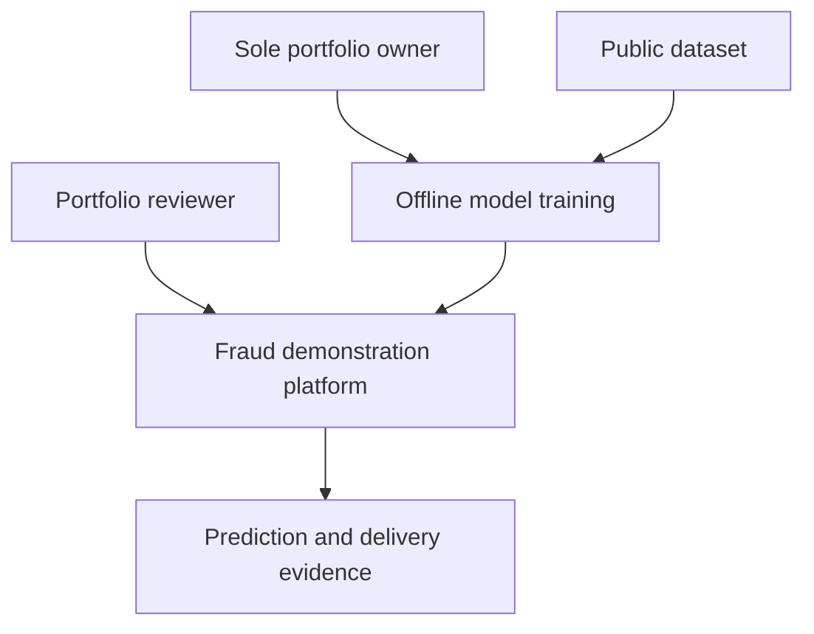
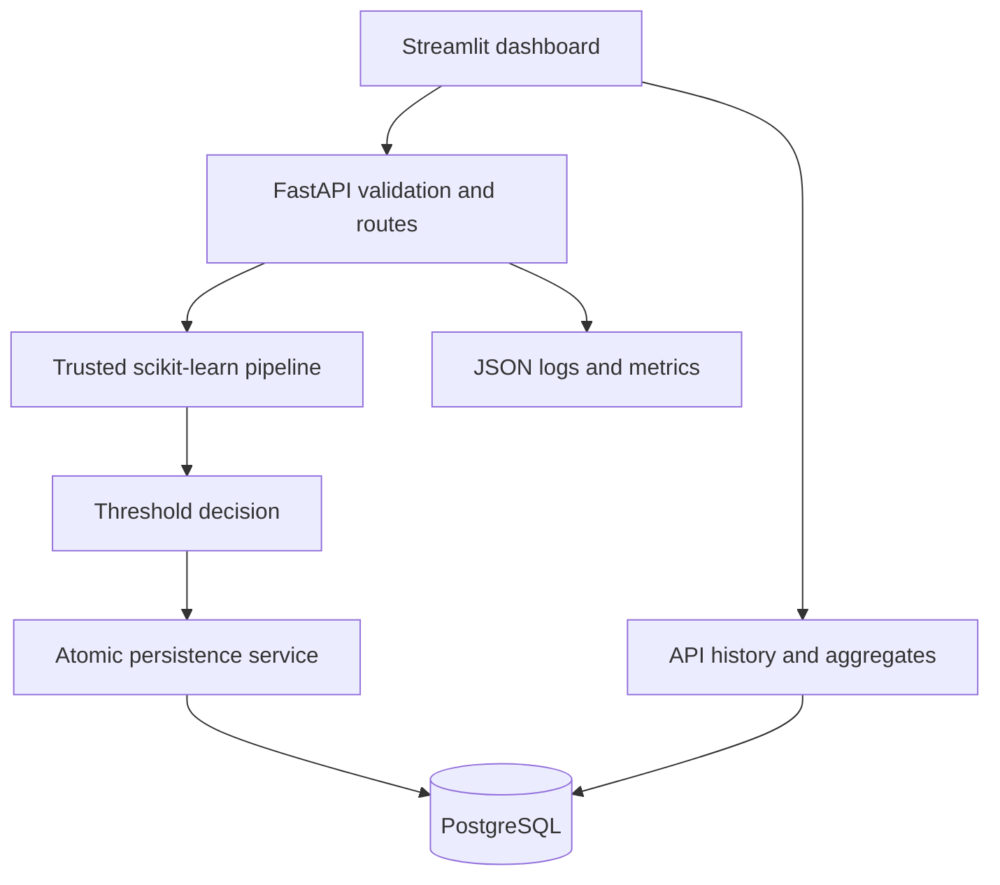
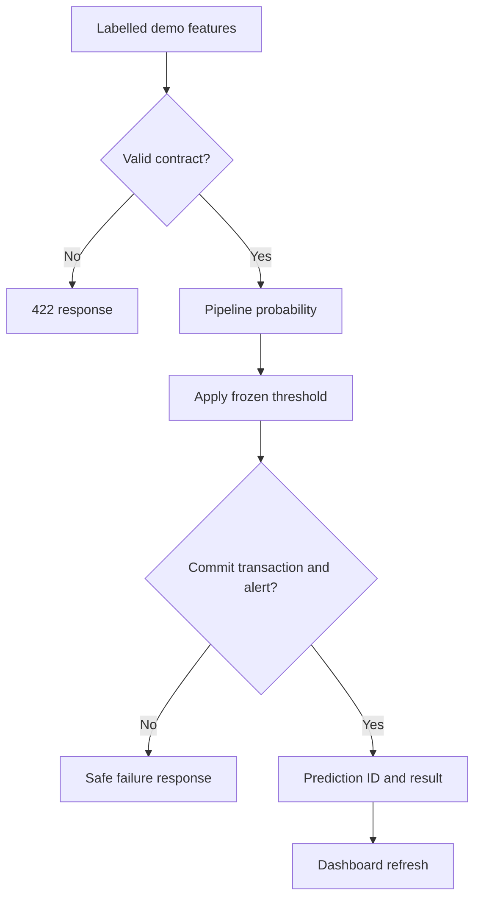
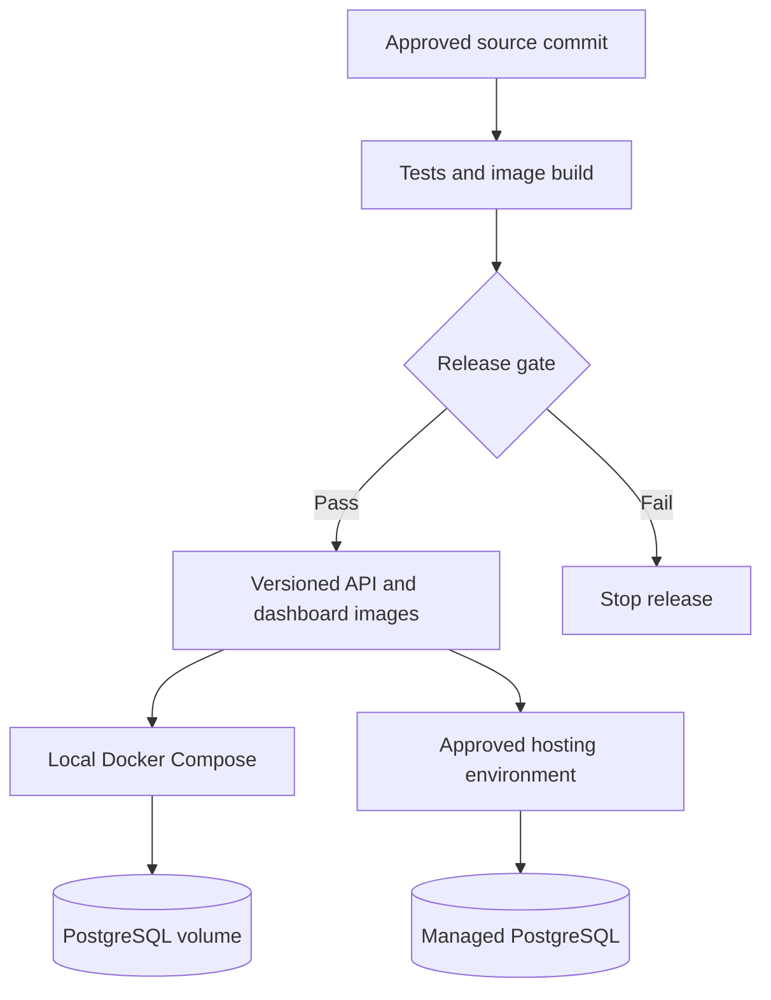

# Proposed architecture — not yet integrated
## System context

## Containers and components

## Request data flow

## Deployment proposal

Current implementation: health/readiness and validation scaffold, data pipeline and offline trained model. API-to-model scoring is tested via /score; PostgreSQL persistence via /predict and conditional alert recording are tested. Dashboard consumes real API analytics/history/alerts; hosted deployment remains proposed. Hosted path requires separate approval. The training pipeline runs offline, never in a prediction request. Proposed database tables: transactions(id UUID, source, schema_version, time, amount, components, created_at); predictions(id UUID, transaction_id FK, probability CHECK 0..1, threshold, risk, decision, model_version, created_at); alerts(id UUID, prediction_id UNIQUE FK, status, created_at). Model metadata is a versioned JSON manifest initially; a separate model registry service is unnecessary.
