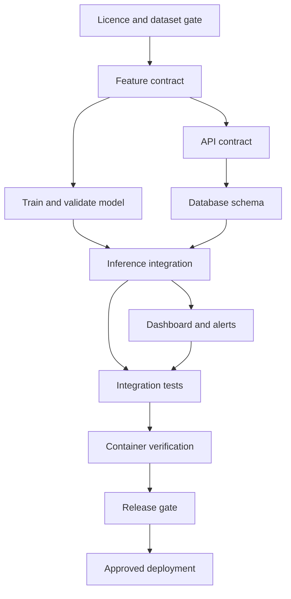

# Fraud Detection & Analytics Delivery Platform

Historical milestone snapshot. Current status: local Compose verification PASSED per user execution report; hosted CI/deployment pending. See [release readiness](release-readiness.md) for superseding gate status.

## Discovery and design baseline — 2 October 2026
**PORTFOLIO PROOF-OF-CONCEPT · design baseline v0.1 · implementation in progress**

Subtitle: From MBA Research to a Working ML-Powered Technical Delivery System.

This is a new, AI-assisted technical portfolio implementation inspired by Sreejith Sivakumar’s research-based MBA dissertation on Big Data analysis and banking fraud detection (topic summary; see source-verification.md for the original wording). The dissertation did not implement this software. Sreejith is the sole project owner and learner; AI provides implementation assistance. Five workstreams are responsibility areas, not five employees. No professional ML-engineering experience is claimed.

The supplied CV and dissertation have now been read. See [source verification](source-verification.md) for supported background and excluded claims, including inconsistent survey sample counts.

## 1. Problem statement
A fraud classifier alone does not demonstrate how an analytics capability is delivered. Input contracts, reproducible evaluation, persistence, review decisions, operational failures and release gates must work together. Build a small, auditable demonstration that accepts dataset-compatible transaction features, produces a genuine model score, records a review decision and exposes aggregate analytics. It must make the cost of missed fraud and unnecessary review visible without claiming real financial impact.

## 2. Product vision and success
A reviewer can follow one request from validated input through model inference to a persisted prediction and dashboard alert, then inspect the tests and delivery decisions supporting that flow. Sreejith can explain each dependency and limitation.

Success means an end-to-end local demonstration, reproducible model evaluation and traceable release evidence. Targets (not achieved results): 100 consecutive valid demonstration requests persisted; invalid inputs rejected with 422; threshold boundaries tested; no successful response when persistence fails; local warm-request p95 below 500 ms at concurrency 1 over 100 requests, with hardware recorded. Model success is measured against a dummy baseline using average precision and a documented precision/recall trade-off, not a promised numerical score. A poor model result is reported rather than hidden.

## 3. Personas and stakeholders
| Persona | Need | Demonstration task |
|---|---|---|
| Portfolio reviewer / hiring manager | Evidence in 60 seconds | Read status, inspect architecture, run one example |
| Sreejith, project owner / learner | Understand delivery boundaries | Explain contract, dependency and release decision |
| SIMULATED fraud review analyst | See why an item enters review | Submit features; inspect score, threshold and alert |
| Sole maintainer | Reproduce and recover | Train, test, restart and follow rollback runbook |

No real banking customer or fraud operations team is a stakeholder. RACI: Sreejith is accountable for all scope, data and release decisions and responsible for operating the project; AI is an assistance mechanism, not an approver. External reviewers are optional future consultees, not invented participants. Public release requires Sreejith’s explicit approval.

## 4. Functional requirements and acceptance criteria
| ID | Requirement / user story | Acceptance evidence |
|---|---|---|
| FR01 | As a maintainer, ingest a licensed labelled dataset | Source and licence recorded; file checksum; exact columns, binary labels, finite numbers, duplicate and imbalance report |
| FR02 | As a reviewer, compare reproducible baselines | Dummy, logistic regression and a bounded random forest evaluated; preprocessing fit on training only; split manifest and seed stored |
| FR03 | As a review analyst, submit compatible features | POST /predict validates schema version, amount, time and 28 numerical components; missing/extra/nonfinite/label fields rejected |
| FR04 | As a reviewer, receive genuine model output | Response score equals loaded pipeline predict_proba result; version and threshold returned; no random or constant substitutes |
| FR05 | As a maintainer, preserve an audit trail | Transaction, prediction and conditional alert committed atomically in PostgreSQL; rollback on failure |
| FR06 | As an analyst, review results | GET /predictions paginated, bounded and newest first; score, decision, UTC timestamp, source label and model version returned |
| FR07 | As a reviewer, inspect model provenance | GET /model-info exposes feature contract, training checksum, evaluation summary and threshold rationale |
| FR08 | As a maintainer, detect failed dependencies | GET /health shows liveness; GET /ready gives 503 if model or DB unavailable |
| FR09 | As an analyst, see analytics and alerts | Streamlit reads API data; aggregates cover all persisted records, not only one page; HIGH results create one alert per prediction |
| FR10 | As a maintainer, observe service operation | JSON request logs omit raw features; request ID, status and duration; /metrics reports request/error counts and inference latency |
| FR11 | As a reviewer, understand limitations | UI and README state portfolio purpose, data provenance and prohibition on real financial decisions |

Contract draft: POST /predict takes schema_version='1', source='SYNTHETIC' or 'DATASET_REPLAY', amount >= 0, time >= 0 (elapsed seconds, not wall clock), and ordered v[28]. Never accept Class as an inference feature. Dataset approval precedes freezing this contract. Output: UUID prediction_id, fraud_probability (model estimate, not established real-world probability), risk_category, decision, threshold, model_version, created_at. HIGH iff score >= selected threshold, otherwise LOW; two categories avoid an arbitrary medium boundary. LOW means NO_REVIEW_TRIGGERED, not financial approval. HIGH means FLAG_FOR_REVIEW. 422 validation; 503 missing model/database; safe 500 unexpected failure. Retried requests are separate submissions in v1; idempotency is deferred and documented.

## 5. Non-functional requirements
| ID | Requirement | Verification |
|---|---|---|
| NFR01 | Repeatable Python environment and training | Version pins; seed 42; data/artifact checksums and ordered feature manifest |
| NFR02 | Safe failure | Missing/mismatched model fails readiness; database failure never returns success |
| NFR03 | Privacy and minimum exposure | No account, card, name, IP or real device identifiers accepted; no raw feature logging; DB not publicly exposed |
| NFR04 | Maintainability | One API, one dashboard, one DB; explicit modules and small tests |
| NFR05 | Auditability | Every prediction links immutable model version and selected threshold |
| NFR06 | Honest performance | Record measured latency and environment; no unmeasured SLA claim |
| NFR07 | Reproducibility | Clean checkout, documented training, tests, Compose build/run and smoke checks |
| NFR08 | Accessibility | Text labels, readable contrast, no colour-only risk indication |
| NFR09 | Limited retention | Demo-only data; proposed manual purge older than 30 days with documented command; not a compliance certification |

## 6. Scope, exclusions and MVP
In scope: offline training, evaluation report, one versioned inference pipeline, synchronous API, PostgreSQL, persisted alerts, Streamlit analytics, local Compose, GitHub Actions definition, delivery evidence and deployment preparation.

Out of scope: live banking integrations, money movement, fraud prevention claims, customer onboarding, real personal data, automated payment rejection, production SLAs, streaming/Kafka, Kubernetes, feature store, multi-tenancy, retraining service, RBAC and elaborate cloud infrastructure. Public unauthenticated arbitrary-data ingestion is not an MVP deployment choice; a public demonstration needs access/rate controls or a constrained read-only presentation.

MVP: one dataset-compatible request → real score → atomic persistence/alert → dashboard, with meaningful tests and a repeatable local launch. A health endpoint alone is foundation work, not the MVP. Dataset examples and synthetic inputs must be visibly distinguished; training/test data never silently become demonstration data.

## 7. Five workstreams
All workstream ownership belongs to the sole owner with AI implementation assistance.

| Workstream | Objective and scope | Deliverables | Dependencies | Main risk | Acceptance / Definition of Done |
|---|---|---|---|---|---|
| WS1 Data & ML | Honest reproducible ranking baseline | Data card, validator, EDA, pipeline, evaluation, artifact manifest | Licence and data access | Leakage / too few positive cases | Split checks pass; metrics reproducible; threshold frozen before test evaluation |
| WS2 Backend/API | Stable scoring interface | Pydantic contract, API, error/logging layer | WS1 feature order and artifact; WS3 transaction boundary | Training-serving mismatch | Real model inference tested; invalid input rejected; DB failures handled |
| WS3 Data & Integration | Consistent prediction audit trail | SQLAlchemy schema, initial versioned schema/migration, queries | WS2 response contract | Partial persistence and duplicate retries | PostgreSQL atomicity and restart persistence tests pass |
| WS4 Platform/DevOps | Repeatable gated release | Dockerfiles, Compose, CI, environment and rollback guides | WS1 artifact packaging; WS2/3 readiness | Container runtime unavailable; hosting limits | Actual builds/run and CI results captured; secrets scan; release commit identified |
| WS5 Product/Analytics | Understandable demonstration | Streamlit submission/replay, aggregates, alerts, README/demo | WS2 API and WS3 aggregate endpoints | Mislabelled flagged share as true fraud rate | Dashboard agrees with DB fixtures; caveats visible; UAT recorded |

## 8. Dependency map and build sequence


Work proceeds in small vertical increments: discovery/design → validate data → train/evaluate/freeze threshold → real prediction API → PostgreSQL transaction → dashboard/alerts → resilience tests → containers → hosted CI → release rehearsal → approved deployment → portfolio claims. Docs and learning checks accompany each increment. Current foundation work can precede dataset approval, but no model contract is final until real columns are checked.

## 9. Initial RAID register
| ID / type | Item and impact | Probability / severity | Owner | Mitigation and trigger | Status |
|---|---|---|---|---|---|
| R01 Risk | Licence/redistribution uncertainty blocks data publication | Medium / High | Sreejith | Record authoritative terms; do not bundle raw data; gate before ingestion | Open |
| R02 Risk | PCA features obscure business explanations | Certain / Medium | Sreejith | Honest numerical feature contract; no invented device/location explanations | Accepted constraint |
| R03 Risk | Leakage inflates evaluation | Medium / High | Sreejith | Chronological split; training-only transformations; exact duplicates kept out of later partitions; held-out test sealed | Open |
| R04 Risk | Few positives create unstable estimates | High / High | Sreejith | Report counts/confusion matrices and uncertainty; no banking-grade claims | Open |
| R05 Risk | False positives overwhelm review | High / High | Sreejith | Validation threshold sweep and illustrative cost sensitivity | Open |
| I01 Issue | Docker and PostgreSQL CLI absent in current runtime | Observed / High for container gate | Sreejith | Continue Python foundation; verify later in capable environment; never substitute SQLite evidence | Open |
| A01 Assumption | Dataset can be acquired without paid service | Unverified / High | Sreejith | Check official acquisition before model work | Open |
| D01 Dependency | Dashboard depends on stable aggregate API | Certain / Medium | Sreejith | Contract first; fixtures explicitly labelled test-only | Planned |
| R06 Risk | Public endpoint abuse / unbounded storage | Medium / High | Sreejith | Local-only initially; review access and rate limits before public deployment | Open |
| R07 Risk | Scope expands into five fake teams | Medium / High credibility | Sreejith | Explicit single-owner attribution; workstreams are planning domains | Controlled |
| R08 Risk | Hosted free-tier expiry loses demo history | Medium / Medium | Sreejith | Export/import demonstration records; treat local Compose as reproducible baseline | Open |

## 10. Architecture and technology decisions
See [architecture diagrams](architecture/design.md). Proposed runtime: Streamlit → FastAPI → scikit-learn pipeline → PostgreSQL. Alerts are rows committed with predictions, not an external messaging system. Dashboard accesses the API, never a second inference implementation or direct database credentials.

| Decision | Choice and rationale | Alternative / trade-off |
|---|---|---|
| ADR01 | Python 3.12; one language for data, API and UI | Avoid TypeScript/frontend build chain in v1 |
| ADR02 | scikit-learn pipeline; logistic regression + bounded random forest, dummy reference | No deep learning, GPU or booster dependency required |
| ADR03 | FastAPI/Pydantic for explicit contract and OpenAPI | More boundary discipline than a dashboard-only model demo |
| ADR04 | PostgreSQL + SQLAlchemy; one initial versioned migration | SQLite cannot demonstrate the required PostgreSQL integration |
| ADR05 | Streamlit for product and analytics | Styling constraints accepted to reduce maintenance |
| ADR06 | Docker Compose: API, DB, dashboard; offline training command | No orchestration cluster or queue needed for synchronous demo |
| ADR07 | GitHub Actions gated tests/build | Local checks are not evidence of a hosted CI run |
| ADR08 | JSON logs, health/readiness, small metrics endpoint | No Prometheus/Grafana infrastructure in v1 |
| ADR09 | Local environment first; Render is a deployment candidate, not an approved service | Free services sleep and free PostgreSQL expires; durable hosting may require budget approval |
| ADR10 | Short feature branches → main; self-review recorded | No develop branch or invented peer approvals |

Deployment decision, checked 2 October 2026: Render’s official documentation says idle free web services sleep, and free PostgreSQL expires after 30 days. Thus an all-free Render deployment is a time-limited demonstration candidate, not a durable portfolio promise. Final provider/cost/access choice remains a phase-11 gate after memory/build measurements. No accounts created and no deployment claimed.

## 11. Dataset selection criteria and provisional candidate
Mandatory: authoritative source and explicit use terms; supervised binary fraud label; documented feature meaning; feasible CPU/memory footprint; no directly identifying fields; natural class imbalance; separable train/validation/test; acquisition repeatable and checksum recorded. Reject unknown provenance, unlabeled data for this supervised MVP, and synthetic data marketed as real banking records.

Provisional candidate: ULB/Worldline Credit Card Fraud Detection on Kaggle. Authoritative search metadata reports 284,807 transactions and 492 fraud labels. These are publisher-reported counts, NOT counts inspected in this project. The page exposes a database licence label, but full terms have not yet been captured. Acquisition, complete licence text and local schema/imbalance validation remain gates. Do not redistribute the CSV or model-derived sample rows until permissions are established. Source fields are expected to include Time, Amount, V1–V28 and Class; verify before freezing schema. No usable location, device or transaction-type fields are assumed.

Expected constraints: historical short observation window, PCA-obscured features, limited transfer to contemporary fraud, unknown original PCA fitting provenance. The project can prevent its own leakage but cannot certify how upstream anonymisation was fitted. No protected attributes means a demographic fairness assessment cannot be substantiated.

Training data remains in ignored data/raw. Separate demo JSON is labelled SYNTHETIC or permitted DATASET_REPLAY. Arbitrary synthetic vectors may be out of distribution and are interface demonstrations, not realistic fraud cases. Test fixtures are never training evidence.

## 12. ML evaluation plan
Validate first. Sort by Time and use approximately earliest 60% training, next 20% validation and latest 20% test, preserving equal-time groups at boundaries. Report per-partition class counts. Identify exact duplicates and prevent duplicate vectors crossing partitions; do not silently remove inconsistent labels. If positives are insufficient, revisit the design before modelling.

Fit scaling and any imputation on training only; reject missing values for the initial dataset contract. Compare dummy, scaled logistic regression (including a documented imbalance-weighting experiment) and a resource-bounded random forest. Use seed 42. Select candidate on validation average precision plus operating-point trade-offs. Report precision, recall, F1, ROC-AUC, average precision (explicitly named, not silently equated with trapezoidal PR-AUC), PR curve and confusion matrix.

Threshold selection uses validation only. Start with an illustrative missed-fraud cost 20 times a false review cost; this ratio is SIMULATED, not a banking estimate. Sweep ratios 5, 20 and 100 and report resulting flags per 1,000 transactions. Tie-break toward fewer false negatives, then fewer reviews. Freeze model and threshold before opening test results. Do not retrain on validation after selecting a threshold without revalidating calibration/operating point. Record score calibration diagnostics; predict_proba is not proof of calibrated real-world risk.

Save only trusted locally generated joblib artifacts plus SHA256, feature ordering, schema version, dependency versions, threshold, data hash and split report. Never load an arbitrary uploaded pickle/joblib artifact.

## 13. Repository architecture
Current foundation files are listed in README; planned modules below are not claims of implementation.

```text
api/                 # HTTP routes, schemas, inference and persistence services
model/               # ingestion, preprocessing, training, evaluation (planned)
database/            # SQLAlchemy models and migration (planned)
dashboard/           # Streamlit application (planned)
tests/               # unit, contract, model and PostgreSQL integration
scripts/             # train, smoke, verification helpers (as needed)
data/README.md       # provenance and acquisition gate; no raw data committed
docs/                # design, decisions, RAID, release evidence, learning
.github/             # workflow and issue/PR templates
artifacts/           # ignored model binaries; trusted release strategy pending
```

## 14. GitHub issue and milestone plan
Local backlog IDs below are not GitHub issue numbers. No remote repository, issue, PR, CI run or release exists yet. Do not manufacture activity. After explicit external-action approval: create repository, milestones, labels and issues; push branch, open PR, run CI, self-review honestly, merge and tag a tested release.

| Milestone | Local issue / story | Exit gate | Depends on |
|---|---|---|---|
| M0 Design | FD01 Baseline scope, contracts, risks and learner checks | 18 design deliverables reviewed; assumptions marked | None |
| M1 Data | FD02 Approve source/licence; FD03 Validate/partition | Provenance + executable checks on actual CSV | FD01 |
| M2 Model | FD04 Compare models; FD05 Freeze threshold/artifact | Genuine validation/test reports and reproducibility | FD03 |
| M3 Vertical slice | FD06 Real inference; FD07 Atomic persistence/alerts | HTTP request creates correct PostgreSQL records | FD05 |
| M4 Product | FD08 Dashboard; FD09 observability/error paths | Aggregates verified; UAT walkthrough | FD06, FD07 |
| M5 Release | FD10 Compose; FD11 CI; FD12 recovery rehearsal | Build/run and hosted CI evidence; rollback tested | FD09 |
| M6 Presentation | FD13 approved deployment; FD14 portfolio claims | Live smoke test where feasible; evidence-linked narrative | FD12 + approval |

Suggested labels: data-ml, api, integration, platform, product, bug, risk, blocked, documentation. Each issue includes user story, acceptance criteria, dependency, evidence and scope. M0 has no fabricated calendar duration; later estimates follow observed build effort.

## 15. Definition of Done and release controls
- Model trained on approved data; evaluated with genuine held-out metrics; threshold provenance recorded.
- API validates, calls actual pipeline and returns versioned score/decision.
- PostgreSQL transactions, predictions and alerts survive restart; failure rolls back.
- Dashboard reads persisted project data and labels flagged share correctly (not measured fraud rate).
- Relevant tests, lint and build pass; clean-checkout instructions exercised.
- Docker images build and Compose starts; readiness and end-to-end smoke pass.
- GitHub CI actually passes at release SHA; definition alone is insufficient.
- Secrets/data excluded; logging audited; public exposure reviewed.
- Deployment tested if feasible and approved; otherwise release limitation explicit, no live-demo claim.
- Architecture and docs match code; every CV/LinkedIn claim has evidence.
- Sreejith answers learning checks; no unaided engineering or employment implication.

No-go triggers: unverifiable licence, test leakage, missing artifact, failed persistence, failing test, exposed secret, broken reproducibility or misleading claim. Proposed rollback: immutable prior application+model version, compatible schema, pre-change demo-data export, restore and smoke check. Schema destructive rollback is not automated. This runbook must be rehearsed before it can be described as tested.

## 16. Test and UAT strategy
Unit: finite inputs, feature ordering, threshold equality, missing artifact. API: 422/503/500 semantics, pagination. ML: repeatable partitions, leakage checks, saved/loaded probability agreement. PostgreSQL: atomic writes, relationships, restart persistence. Integration: submit→read→aggregate→alert. Containers: clean build and ready health checks. UAT: valid low/high examples, rejected input, unavailable DB and dashboard counts. Owner records observed outcome and screenshots; no fake analyst sign-off. No claim of penetration testing, fairness certification or production load testing.

## 17. Controlled scenarios planned, not executed
A: versioned feature-contract change and backend impact; B: database milestone delay and dashboard replan; C: deliberately failing test blocks CI; D: threshold review-volume trade-off using real validation results and SIMULATED costs; E: failed demo release followed by rollback rehearsal. Every scenario will record trigger, impact, owner, decision, milestone update, corrective action and observed evidence. None has occurred merely because this list exists.

## 18. Design challenge and simplification
Is it over-engineered? Three runtime services are sufficient. Remove queues, cloud IaC, RBAC and microservices. Is every technology necessary? PostgreSQL and FastAPI intentionally teach persistence and API boundaries; Streamlit reduces UI maintenance; Docker/CI address reproduction. Can one person maintain it? Yes at bounded demo scope with offline training and short branches, not a 24/7 service commitment. Does it show TPM capability? Only when backlog acceptance evidence, blockers and release decisions track actual work. Can a recruiter understand it? README opens with status, one request path and genuine evidence. Can Sreejith explain it? Knowledge checks gate the story, not just file generation.

Incremental portfolio value (based on the projects described in the brief, not an audit of unseen repositories): adds trained-model lifecycle, threshold trade-offs and transactional model-serving evidence beyond workflow automation and BI reporting. Avoid repeating generic PM paperwork. A later evidence audit should compare actual existing repositories before claiming uniqueness.

## Sources checked
- Dataset publisher: https://www.kaggle.com/datasets/mlg-ulb/creditcardfraud (source metadata checked; complete terms gate remains).
- Threshold separation: https://scikit-learn.org/stable/modules/classification_threshold.html (validation separate from model fitting).
- Hosting limits: https://render.com/docs/free (checked 2026-10-02; recheck before deployment).

## Knowledge checks
Phase 0: (1) Why is this an extension of the dissertation rather than part of it? (2) Why are five workstreams not evidence of managing five developers? (3) What evidence is required before claiming the model works?

Phase 1: (1) Why must the API use the model’s exact feature contract? (2) What happens if inference succeeds but the database commit fails? (3) Why choose a threshold on validation rather than test data? (4) Why is flagged share not the fraud rate? (5) Which dependency should block a release even if the dashboard looks complete?

Learner responses pending; no understanding or approval is assumed.
